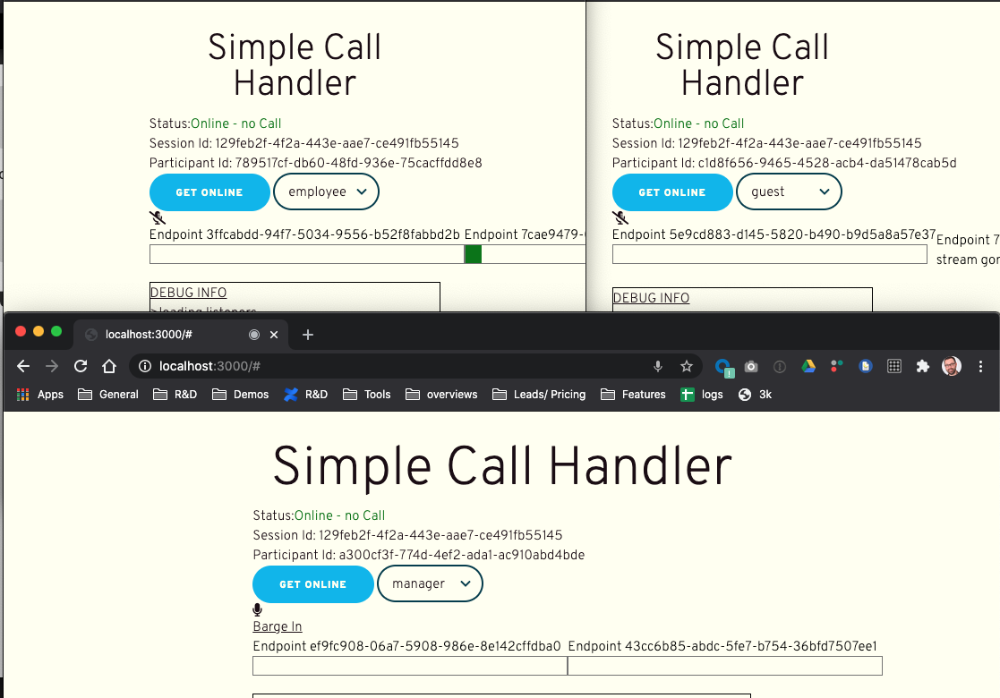
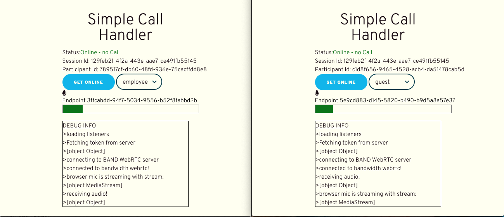

# WebRTC Whisper & Barge

This sample app allows you to create a scenario where there is an _employee_ talking with a _guest_ and where a _manager_ may join in. The interesting part is that the _manager_ can hear everyone, but is only heard by the _employee_ - which is called a _whisper_.

**NOTE**: this has been updated to support dialout as well, see end of this document for details.

Below you can see an example of all the participants in the session


Here is an example of the demo in action: https://youtu.be/iAFnd87RNYk

## Architecture Overview

This is a node app that receives the requests from the browser. This node app also makes requests to Bandwidth's API and receives callbacks when a call is answered.

## Setting things up

Make a copy of the default config file and update values accordingly:

```
cp .env.default .env
vi .env
#update values...
```

- `ACCOUNT_ID` can be found in the top right of the Bandwidth dashboard
- `USERNAME` is the username of an API user you create in the dashboard; _Note_: API-only users don't have required password rotation
- `PASSWORD` for said user above

- `VOICE_APPLICATION_ID` is the of a valid application you have configured within the Bandwidth dashboard.
- `BASE_CALLBACK_URL` is the url of your development server, this url will be referenced as the `answerUrl` and Bandwidth will issue callbacks to this when the call is answered.
- `FROM_NUMBER` this is what will be shown as the 'caller_id' on any outbound calls
- `OUTBOUND_PHONE_NUMBER` this is the number that will be called when you click the "Dial Out" button.

### Install dependencies and build

```bash
npm install
node server.js
```

or

```
npm install
nodemon
```

### Using the App

1. Browse to [http://localhost:3000](http://localhost:3000) and grant permission to use your microphone.
2. Select a user-type - note that you need a non-guest to join first, I suggest employee
3. Click **Get Online**
4. Open another browser window at [http://localhost:3000](http://localhost:3000)
5. Select a type of _Guest_
6. Click **Get Online**
7. Open another browser window at [http://localhost:3000](http://localhost:3000)
8. Select a type of _Manager_
9. Click **Get Online**
10. Now when you talk, you should hear multiple people talking and see volume graphs on each page.
11. Mute each party one at a time and try talking, you should see the other parties volume graph go off
    <br />
    <br/>
12. Cycle through all the participants, watching who hears who
13. You can make the _Manager_ **Barge in** to the call, at which point they become an _employee_ and can be heard by the _guests_. They can revert to **Whisper** again afterwards.

## Dial Out

This demo was updated to support dialing out as well. The dial out number is hard coded in the config, but can easily be modified to dynamically dial different numbers.

The person who is called will be automatically added as a _Guest_ in this demo app.

Once "online", you will be presented with a Dial Out button, if clicked, the `server.js` function `/startPstnCall` will be called, which will dial the number specified in your `.env` file.

## How this works

The implementation of a Whisper is managed by controlling the subscriptions at the participant level.

Most of the sample WebRTC applications make use of Session-level subscriptions. In Session-level subscriptions, all participants added to a session will automatically be subscribed to each other, which can save a lot of tedious subscription management.
A session subscription:

```
{
    "sessionId": "d8886aad-b956-4e1b-b2f4-d7c9f8162772",
}
```

As noted above, this app makes use of Participant-level subscriptions, so you will manually list each participant that you want this participant to subscribe to. These values can be updated throughout the call as new participants arrive or if you wish to change the "layout" of the call subscriptions. Here is an example Participant-level subscription:

```
{
    "sessionId": "d8886aad-b956-4e1b-b2f4-d7c9f8162772",
    "participants": [
        {
            "participantId": "568749d5-04d5-483d-adf5-deac7dd3d521"
        },
        {
            "participantId": "0275e47f-dd21-4cf0-a1e1-dfdc719e73a7"
        }
    ]
}
```

Note that the sessionId is still provided in both instances.

In this demo, we create our subscriptions for each user by their role.

- Managers are subscribed to everyone's published streams
- Employees are subscribed to everyone's published streams
- Guests are only subscribed to Guests' or Employees' published streams

This creates a situation where Guests can't hear Employees, and in effect, the Managers are _whispering_ to the other Managers and Employees.

It's also helpful to note that while we initially create our subscription with addParticipantToSession, when we wish to update the subcriptions (which is required any time someone new joins the session) we will use updateParticipantSubscriptions. Also note that, the parameters on these functions are unfortunately not exactly the same:

```
await webRTCController.addParticipantToSession(
	account_id,
	session_id,
	participant_id,
	body
);
```

vs

```
await webRTCController.updateParticipantSubscriptions(
	account_id,
	participant_id,
	session_id,
	body
);
```
